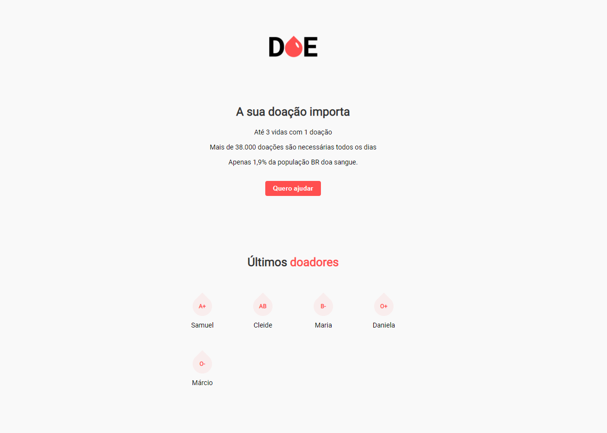
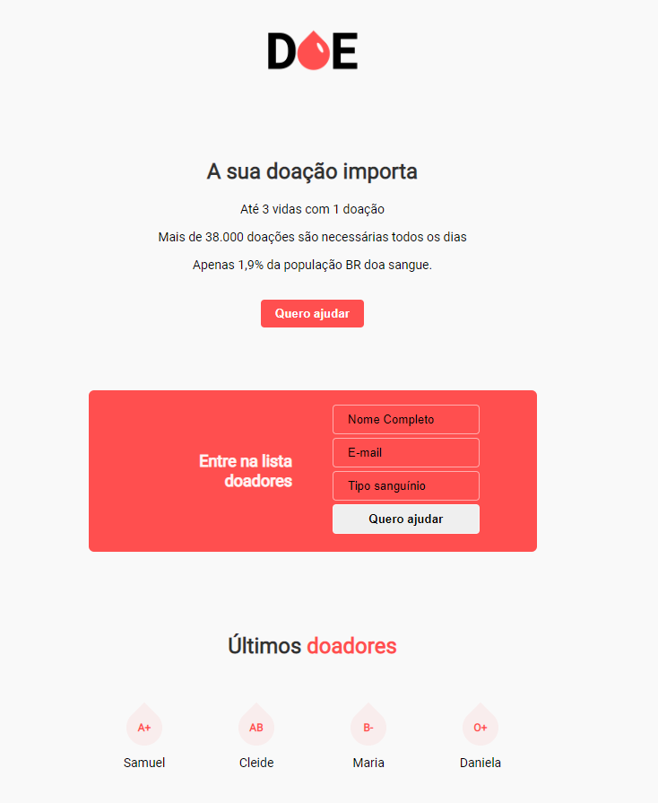

# maratona-dev-rocketseat
 Repositório responsável por armazenar o conteúdo desenvolvido durante a **Maratona Dev** promovida pela Rocketseat.

## DOE sua doação importa:

O projeto foi desenvolvido em dois dias durante o evento Maratona Dev da rocketseat.
O DOE é uma aplicação de cadastro de doadores de sangue.
Nesse sentido, o usuário pode dizer seu nome, email, e tipo sanguínio.
Após o cadastro ser feito, ele é adicionado no painel de últimos doadores.

## Tecnologias utilizadas:
* Front-end: HTML, CSS e JavaScript
* Back-end: Node.js
   * Banco de dados: sqlite3

## Como rodar:
1. Primeiro passo: iniciar o `npm install` para instalar as dependencias
1. Rodar `npm start` para iniciar o servidor
